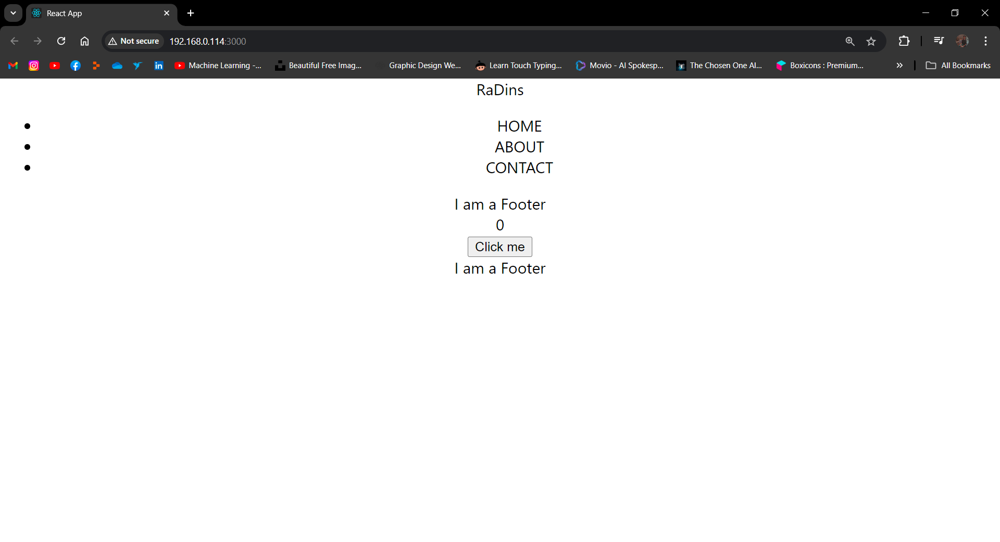

# Why React?
- We can use states which means that once we update the state variable, it changes across the page
- We can split our app into multiple components and reuse those components
- React uses a virtual DOM to efficiently update the UI which is better than updating content using DOM Manipulation
- Debugging and maintainance is easy

## DOM Manipulation Is Not Easy Without React

## Counter Without React

## Counter With React / It Looks Ugly Because It Is Not Styled

